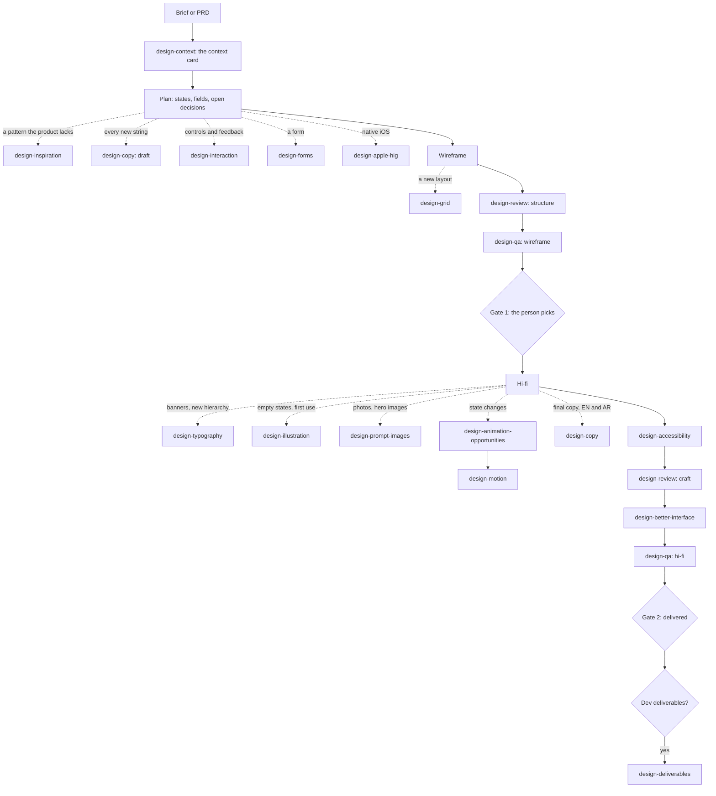

# The design-* skills

Seventeen small skills that each do one design job well, for any product. A
design-system skill (such as `profolio-ksa-design`) calls them as its work
needs them; a person can call any of them directly; another skill can too.

## The one rule: context first

None of these skills knows which product it is working on until it looks.
Each starts with the context step (`_shared/context.md`): find the product's
context card, or build one, and work only inside it. The card is
`design/context.json` (`_shared/context.schema.json`): platforms, colours,
type, spacing and grid, motion, components, voice, assets, rules, every value
marked measured, derived or assumed.

A design-system skill that follows this contract ships its card at its root
(`context.json`), so the skills it calls start already knowing the product.
Without one, `design-context` reads the product's code, renders or
screenshots.

Nothing product-specific lives in these folders. The build refuses a skill
that names a product.

## When each one is called



Design QA runs at both gates: on the wireframe for structure, layout and what
opens, and on the hi-fi for everything.

| skill | what it does | output | version |
|---|---|---|---|
| `design-context` | finds the product's design language and writes the card | `design/context.json`, `context.md` | 1.0.0 |
| `design-review` | a senior critique: blocking, important, polish, each with a fix | `review.json`, `review.md` | 1.0.0 |
| `design-qa` | renders every screen and case, measures them, opens what opens | `report.json` (schema v1), `report.html` | 1.1.0 |
| `design-deliverables` | the hand-over to engineering, gated on design-qa's hi-fi report | one self-contained HTML | 1.1.0 |
| `design-copy` | interface copy in the product's voice, English and Arabic | copy deck | 1.0.0 |
| `design-inspiration` | patterns the product lacks, from Mobbin and the web, cited | reference board | 1.0.0 |
| `design-interaction` | states and feedback for every control; touch and gestures | interaction spec | 1.0.0 |
| `design-forms` | fields, validation, errors and success | form spec | 1.0.0 |
| `design-accessibility` | WCAG 2.2 AA: contrast, focus, labels, keyboard, screen readers, RTL | fixes, dev annotations | 1.0.0 |
| `design-grid` | columns, gutters, margins, spacing, breakpoints | layout spec, grid overlay | 1.0.0 |
| `design-typography` | the scale in use, hierarchy, display type, Arabic pairing | type spec | 1.0.0 |
| `design-motion` | durations, easing, choreography, reduced motion; the CSS | motion spec, CSS | 1.0.0 |
| `design-animation-opportunities` | where motion helps, and where it would not | ranked table | 1.0.0 |
| `design-illustration` | the product's own art first; new SVG in its style, flagged | SVGs | 1.0.0 |
| `design-prompt-images` | image prompts in the product's art direction | prompts or images | 1.0.0 |
| `design-better-interface` | a polish pass, annotated on the design | annotated screens | 1.0.0 |
| `design-apple-hig` | Apple's Human Interface Guidelines for iPhone, iPad and Watch | checks, specs | 1.0.0 |

Your organisation's `design-icons` skill fills in any icon the product lacks.

## How they talk

Only through files, never by reading each other's instructions:

| file | written by | read by |
|---|---|---|
| `design/context.json` | design-context, or a design-system skill | every skill |
| `report.json` | design-qa | design-deliverables, design-review (so it does not repeat a finding) |
| `review.json` | design-review | the skill that made the design, and the next review |

Each schema carries `schema_version`; consumers pin to it, not to a skill's
version.

## Installing

Publish each `.skill` to your organisation as **Installed by default**. The
main skill also carries a copy of each in `skill/skills/` and uses it when one
is not installed, so a design never stops for want of a skill.

## Building

```bash
node scripts/design-skills.mjs            # dist/design-skills/<name>.skill, and skill/skills/
node scripts/design-skills.mjs --check    # the checks only (CI)
node tests/design-skills/run.mjs          # the skills on a product that is not Profolio
```

The build adds the shared parts to every skill (`_shared/`: the context step,
the card's schema, the versioning note, `_version.py`, and `browser.mjs` for a
skill that renders), checks each skill's frontmatter, version and changelog,
and refuses a skill that names a product.
